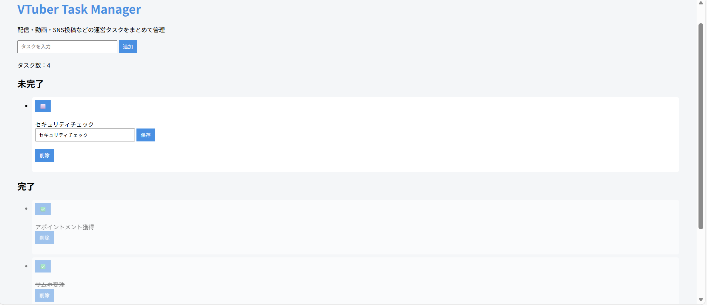

# VTuber Task Manager

配信・動画・SNS投稿などの運営タスクを、シンプルに登録・完了管理できるタスク管理アプリです。  
Flask + Jinja + JSON永続化で作成しました。

## Demo



## Features

- タスク追加（空入力は不可）
- タスク完了 / 未完了の切り替え
- タスク編集（編集ボタンを押した時だけ入力欄表示）
- タスク削除
- JSONファイル（tasks.json）への保存（永続化）

## Tech Stack

- Python 3.9.x
- Flask
- Jinja2
- HTML / CSS
- JSON（ファイル保存）

## Setup

### 1) Clone

```bash
git clone https://github.com/lvkfc1623-arch/vtuber-task-manager.git
cd vtuber-task-manager
