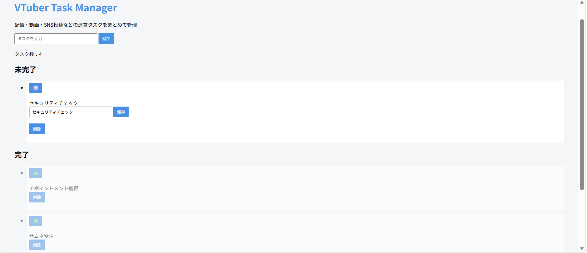

# VTuber Task Manager

## 概要
VTuberの配信・SNS運用タスクを管理するWebアプリです。

## 機能
・タスク追加
・完了/未完了切り替え
・編集
・削除

## 使用技術
・Python（Flask）
・HTML / CSS
・SQLite（予定）

## 起動方法
py app.py
→ http://127.0.0.1:5000

## 今後の改善
・データベース化（進行中）
・クラウドデプロイ

## Demo

